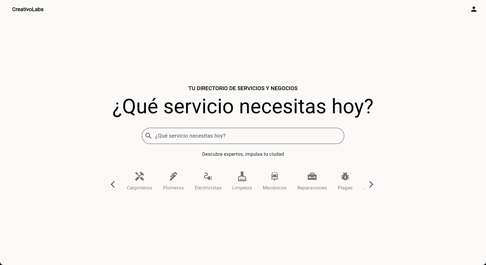

# CreativoLabs

A cutting-edge Flutter application designed to deliver modern user experiences with clean architecture and scalable design. Build with heart using Flutter and Firebase.

---

## Preview



---

## Features

- Firebase Integration (Auth, Firestore)
- URL launcher
- Navigation with `go_router`
- Localozation ready
- Custom icons with `font_awesome_flutter`
- State management with `provider`

---

## Dependencies

This project uses:

- Flutter SDK 3.24.5
- Firebase Core ^3.10.1
- Cloud Firestore ^5.6.0
- Firebase Auth ^5.4.2
- Go Router ^15.1.1
- Provider ^6.1.5
- Intl ^0.19.0

See full list in [`pubspec.yaml`](./pubspec.yaml)

---

## Setup & Installation

1. **Clone the repo**
```bash
git clone https://github.com/SaulSandovalM/creativoLabs.git
cd creativolabs
```

2. **Install dependencies**

```bash
flutter pub get
```

3. Add your .env file

Create a .env file in the root with the following keys:

```bash
FIREBASE_API_KEY=
FIREBASE_APP_ID=
FIREBASE_MESSAGING_SENDER_ID=
FIREBASE_PROJECT_ID=
FIREBASE_AUTH_DOMAIN=
FIREBASE_STORAGE_BUCKET=
FIREBASE_MEASUREMENT_ID=
```

---

## Run the app

```bash
flutter run -d chrome
```

---

## Environment Configuration

Sensitive config is managed using [flutter_dotenv](https://pub.dev/packages/flutter_dotenv)
Environment variables are defined in .env and must not be committed

---

## Running Test

```bash
flutter test
```

---

## Architecture

This project follows a scalable, modular structure:

```bash
lib/
├── api/
├── core/
├── providers/
├── routes/
├── screens/
└── main.dart
```

---

## Contributing

Pull requests are welcome. For major changes, please open an issue first to discuss what you would like to change.

Please make sure to update tests as appropriate.

---

## License

This project is licensed under the [MIT License](https://github.com/SaulSandovalM/creativoLabs/blob/main/LICENSE)

---

## Author

**Saúl Sandoval Mondragón**
Cyberpunk developer. Building the future with code and caffeine.

[Portafolio](https://saulsandovalm.github.io/Portfolio/) • [Facebook](https://www.facebook.com/SaulSandovalM) • [X](https://x.com/SaulSandovalM) • [Instagram](https://www.instagram.com/saulsandovalm/) • [YouTube](https://www.youtube.com/@saulsandovalm)

---

> **Deploy Destroy Repeat**